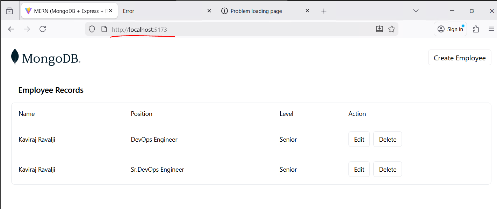
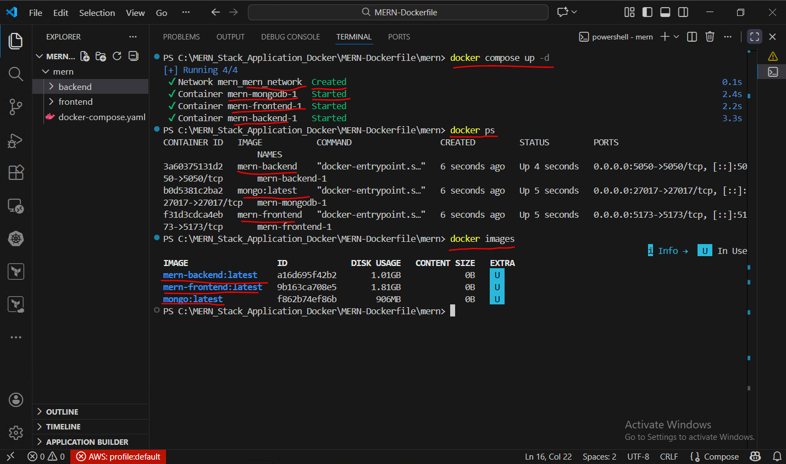
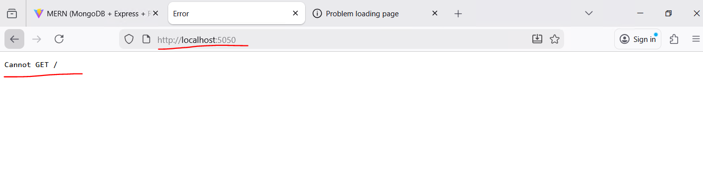
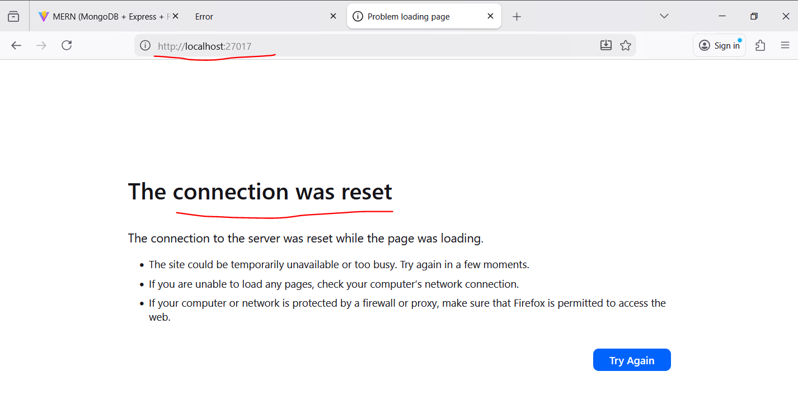
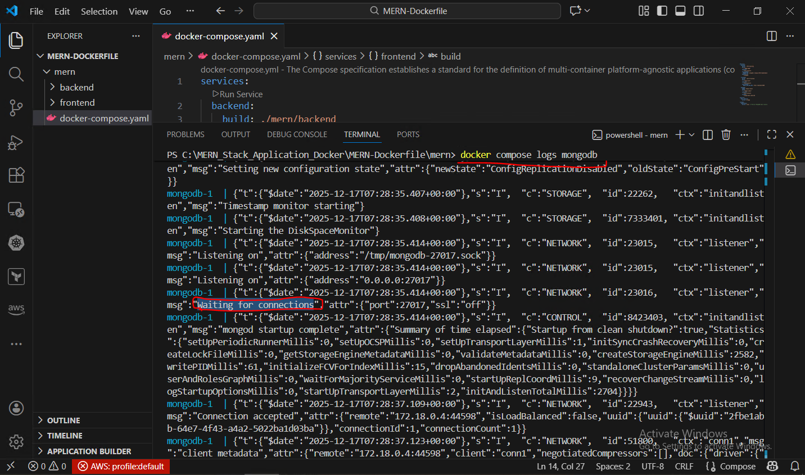
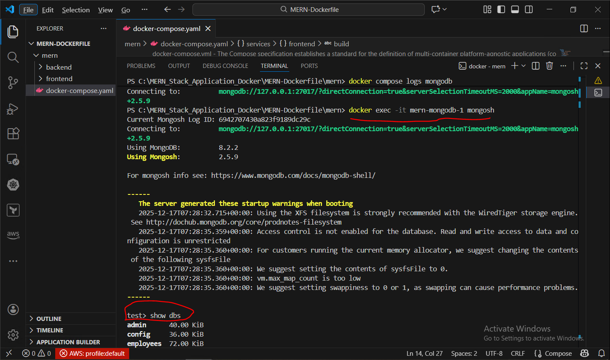

# MERN Stack Application using Docker Compose


This repository contains a **MERN stack application** (MongoDB, Express, React, Node.js) running locally using **Docker Compose**.

The goal of this project is to understand:

- How multiple services work together in Docker
- Docker networking between frontend, backend, and database
- Common mistakes (like accessing MongoDB from a browser)
- Real-world local development setup using containers

This is a **learning and practice project**, not a production deployment.

---

## Tech Stack

- **Frontend:** React (Vite)
- **Backend:** Node.js + Express
- **Database:** MongoDB
- **Containerization:** Docker
- **Orchestration:** Docker Compose

---

## Project Structure

```text
mern/
├── frontend/                 # React frontend (Vite)
│   ├── Dockerfile
│   └── src/
├── backend/                  # Node.js + Express API
│   ├── Dockerfile
│   └── src/
├── docker-compose.yaml       # Docker Compose configuration
└── README.md
```


## Prerequisites

Make sure you have the following installed:

- Docker Desktop
- Git

No local Node.js or MongoDB installation is required.

---

## How to Run the Application

### 1. Clone the repository

```bash
git clone https://github.com/kavirajravalji0410/MERN-docker-compose.git
cd MERN-docker-compose/mern
```

### 2. Start all services
```
docker compose up -d --build
```
Docker will build images and start:

- Frontend
- Backend
- MongoDB

### Application URLs
| Service  | URL                                            |
| -------- | ---------------------------------------------- |
| Frontend | [http://localhost:5173](http://localhost:5173) |
| Backend  | [http://localhost:5050](http://localhost:5050) |
| MongoDB  | mongodb://localhost:27017                      |

### About Backend ```(Cannot GET /)```
If you open:
```
http://localhost:5050
```

You will see:
```
Cannot GET /
```
This is **normal**.
 - The backend is running correctly
 - No route is defined for ```/```
 - API routes are exposed under ```/api/*```

This confirms the backend container is healthy.

### Important Note About MongoDB (Very Common Confusion)
MongoDB is not a web server.
 - MongoDB does not use HTTP
 - Browsers use HTTP
 - MongoDB uses a binary TCP protocol
   
  So this will always fail:
```
  http://localhost:27017
```
Browser ❌ → MongoDB ❌

This is expected behavior. 

There is nothing to fix.

###  Correct Ways to Verify MongoDB
 **Method 1: Check MongoDB logs**
```
docker compose logs mongodb
```
You should see:
```
You should see:
```
This means MongoDB is ready.

### Method 2: Connect using Mongo Shell
```
docker exec -it mern-mongodb-1 mongosh
```
If you get:
```
test>
```
MongoDB is running properly
You can verify data with:
```
You can verify data with:
```
### Docker Networking (Internal Communication)
Inside Docker Compose network:
 - Frontend talks to backend using:
```
http://backend:5050
```
Backend talks to MongoDB using:
```
mongodb://mongo:27017/employees
````
Service names are resolved automatically by Docker DNS.

### Useful Docker Commands
```
docker compose ps
docker compose logs frontend
docker compose logs backend
docker compose logs mongodb
docker compose down -v
```
### Screenshots
(Screenshots taken from local setup)

- Frontend UI running on ```localhost:5173```
- Backend response on ```localhost:5050```
- Docker containers running
- MongoDB logs ```(Waiting for connections)```
- Mongo shell ```(mongosh)``` output
  
Screenshots will be added in the ```screenshots/``` folder.

## Screenshots

### Frontend UI


### Docker Containers Running


### Backend Response


### mongo-webpage



### MongoDB Logs



### Mongo Shell



### Notes
- This setup is meant for local development and learning
- MongoDB port is exposed only for testing
- Do not use this configuration directly in production
- No authentication is enabled for MongoDB

### Author
**Kaviraj Ravalji**

DevOps Engineer

GitHub:
https://github.com/kavirajravalji0410

**Final Thoughts**

This project helped me understand:
  - Docker Compose in real scenarios
  - Service-to-service communication
  - Common MongoDB misconceptions
  - Debugging containerized applications

Feel free to fork or use it as a reference.
